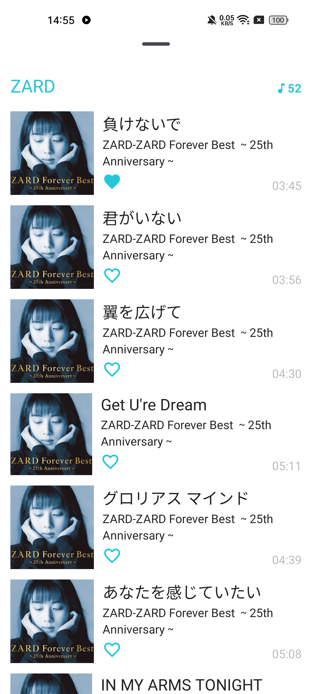

## Summery

Simple local video and audio files player. Support ascii art filter, subtitle render and so on. Base on (tMediaPlayer)[https://github.com/Tans5/tMediaPlayer].

## Screenshots

   

  

 